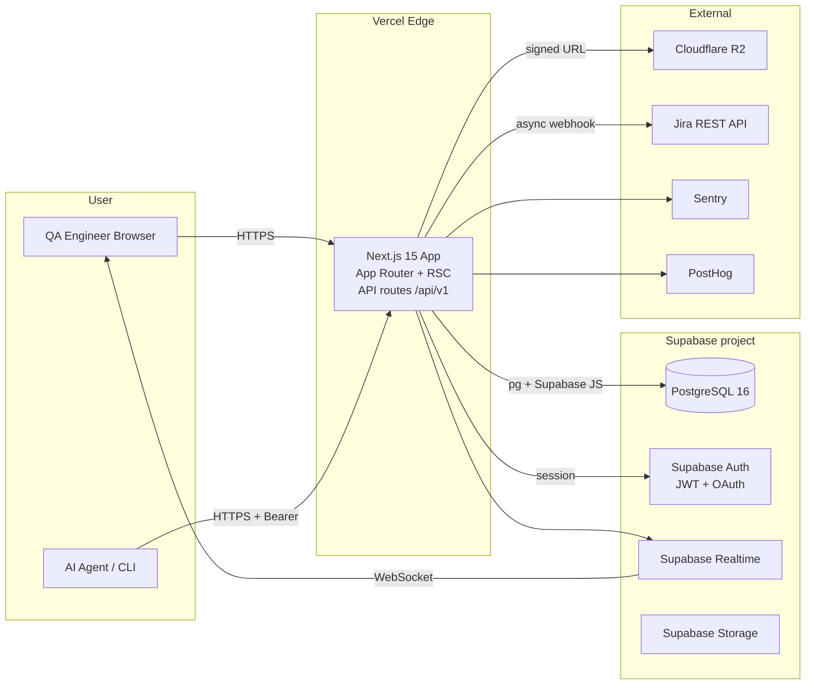
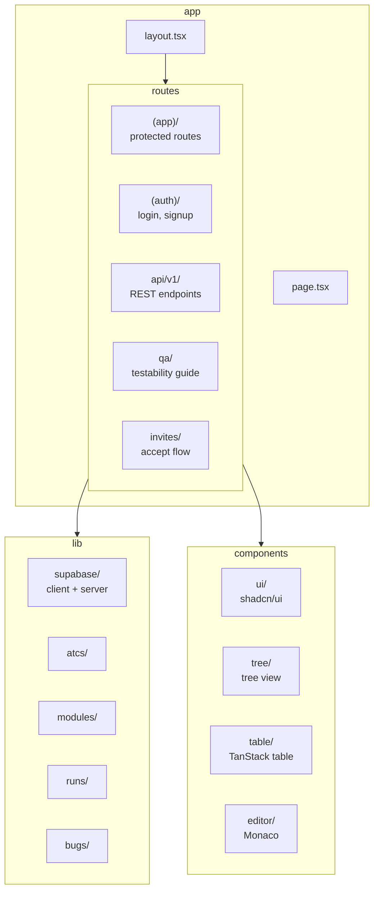
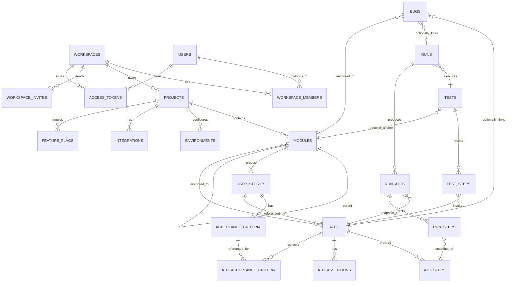

# Architecture Specifications — Bunkai (QA Context)

> Source: target `.context/SRS/architecture-specs.md`. C4 + ERD + component specs adapted for QA context.
> Stack: Next.js 15 (App Router) + Supabase (PostgreSQL, Auth, Realtime, Storage) + Vercel + Cloudflare R2.

---

## System Overview

**Pattern**: Next.js App Router with React Server Components. API routes handle backend logic. Supabase provides DB, Auth, Realtime, and Storage. Serverless on Vercel.

### Tech Stack

| Layer | Technology |
|---|---|
| Frontend | Next.js 15 (App Router, RSC, typedRoutes) |
| UI Components | shadcn/ui (Radix UI primitives) + Tailwind CSS |
| Client State | TanStack React Table |
| Editor | Monaco Editor |
| API | Next.js Route Handlers (`app/api/v1/*`) |
| Validation | Zod (server + client) |
| Database | Supabase PostgreSQL 16 |
| Auth | Supabase Auth (JWT, OAuth GitHub/Google, magic link) |
| Realtime | Supabase Realtime (logical replication) |
| Object Storage | Cloudflare R2 (S3-compatible) |
| Monitoring | Sentry |
| Analytics | PostHog |
| Deploy | Vercel |

## C4 Context Diagram



## Component Structure



## Database Schema (ERD)



## Auth Architecture

**AuthN**: Supabase Auth (JWT). Three methods:
- Magic-link email
- GitHub OAuth
- Google OAuth

**AuthZ**: RBAC at Workspace level enforced by Supabase Row Level Security (RLS) policies.

**Session**: 1h access token, 30d refresh token, sliding renewal.

Protected routes: `/projects/*`, `/onboarding/*` (via `middleware.ts` using Supabase SSR client).

## Data Flow — Run Execution

```
User/Agent → POST /runs → Run created (created)
  → POST /run_steps/{step_id}/result → Run progresses (running)
  → ALL steps passed → Run→passed
  → ANY step failed → Run→failed
  → Agent aborts → Run→aborted
  → Bug filed (POST /bugs) linked to Run + ATC + Module
```

## External Services

| Service | Purpose | Integration Point |
|---|---|---|
| Supabase | Database, Auth, Realtime, Storage | Supabase JS client |
| Cloudflare R2 | Blob storage for evidence | S3-compatible signed URLs |
| Jira (optional) | Bidirectional issue sync | REST API webhook |
| Sentry | Error monitoring | Sentry SDK |
| PostHog | Product analytics | PostHog SDK |

## Security Architecture

- AuthZ: RLS policies on every table with `workspace_id`
- Input validation: Zod schemas server + client
- Markdown sanitized via `rehype-sanitize`
- Rate limits: 100 req/min write, 600 req/min read
- CSP: strict, nonces for inline scripts
- Secrets: never in code, `.env` for local, Vercel env vars for prod/staging

## QA Relevance

| Component | Test Approach |
|---|---|
| API routes (`app/api/v1/*`) | Contract testing via REST calls |
| RLS policies | AuthZ bypass attempts (cross-workspace access) |
| Auth middleware | Unauthenticated redirect, token expiry |
| Supabase Realtime | Real-time UI updates during Run |
| Jira sync | Bidirectional sync consistency, conflict resolution |
| Cloudflare R2 | Evidence upload/download, signed URL expiry |

## Discovery Gaps

- [ ] Live database schema not confirmed — migrate from Supabase migrations
- [ ] OpenAPI spec served at `/api/openapi.json` — verify at runtime
- [ ] Real Supabase RLS policies — need to read from `supabase/migrations/`
- [ ] Jira integration not fully implemented (MVP scope)
