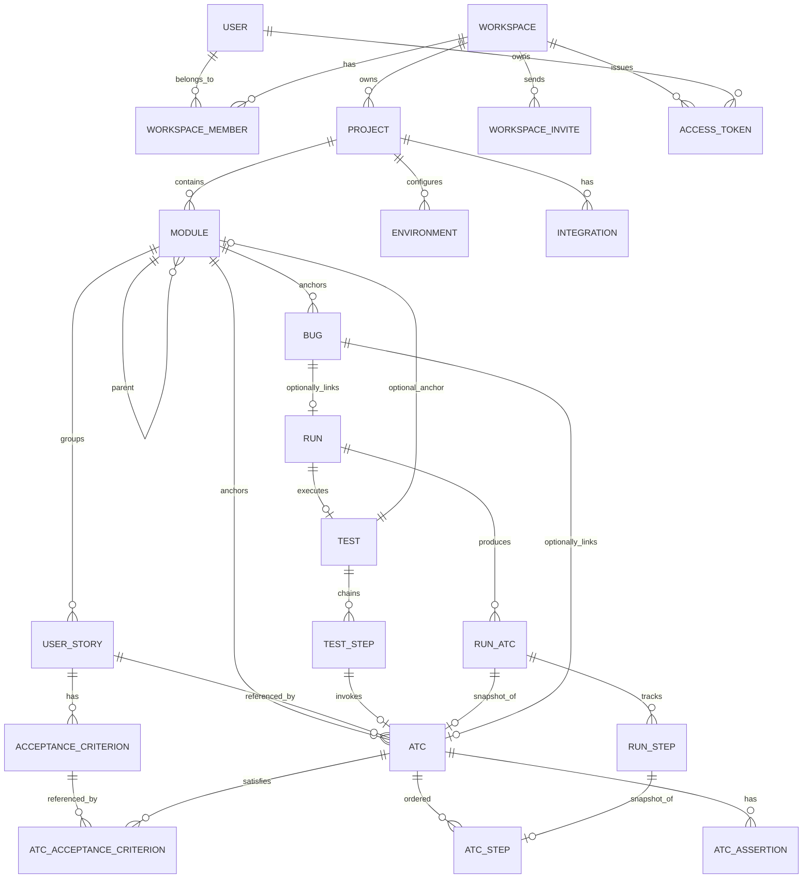
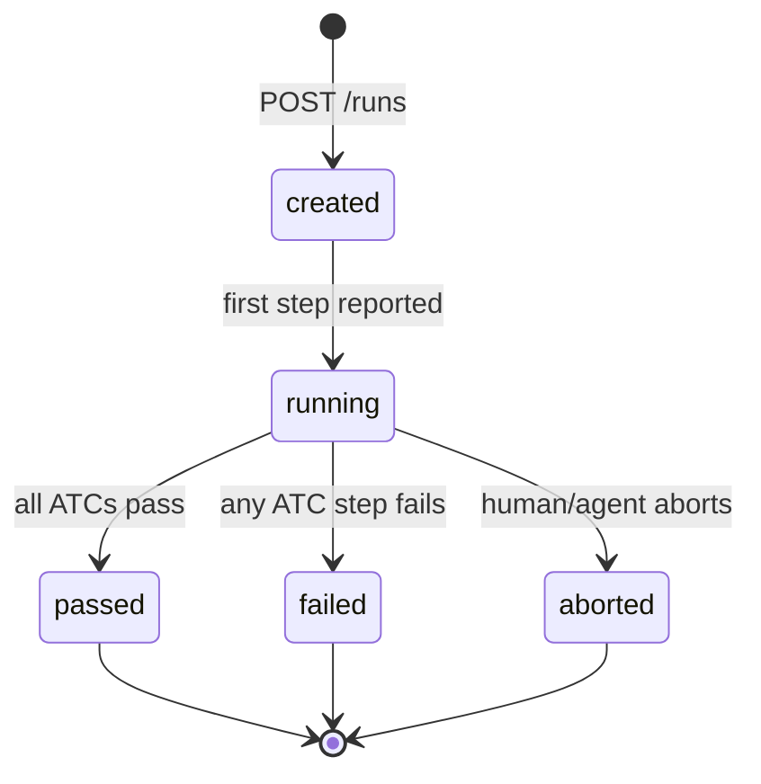
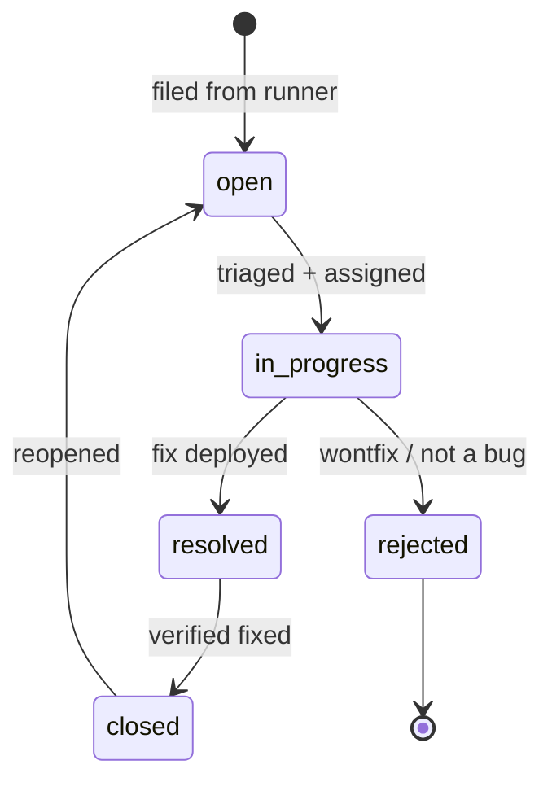
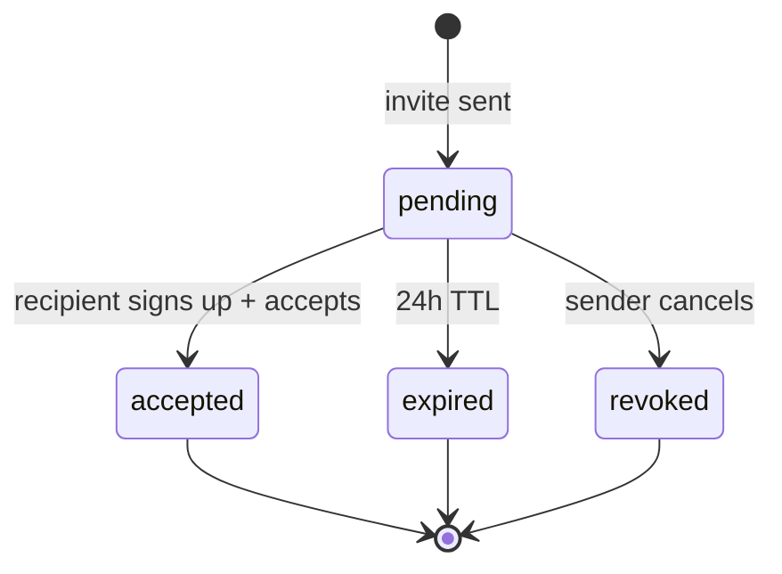

# Domain Glossary — Bunkai

> Core domain entities extracted from target `.context/SRS/architecture-specs.md` (ERD), `.context/business/business-data-map.md`, and `functional-specs.md`.
> Primary: TMS domain. Language: en (code), es (UX copy for some personas).

---

## Core Entities

### User

| Field | Value |
|---|---|
| Technical Name | `user` |
| Business Name | User |
| Description | Supabase Auth user. Identity across Workspaces. |
| Table/Collection | `auth.users` (Supabase managed) |
| Key Attributes | `id` (UUID), `email`, `display_name`, `avatar_url` |
| Found In | `middleware.ts`, `app/api/v1/*` |

**Relationships**: Has many `workspace_members`, has many `access_tokens`.

### Workspace

| Field | Value |
|---|---|
| Technical Name | `workspace` |
| Business Name | Workspace |
| Description | Multi-tenant root. Isolates all data per organization. |
| Table/Collection | `workspaces` |
| Key Attributes | `id` (UUID), `name`, `slug` (globally unique, kebab-case), `created_at` |
| Found In | `.context/SRS/architecture-specs.md` ERD, `functional-specs.md` BK-002 |

**Relationships**: Owns `projects`, has `workspace_members`, sends `workspace_invites`, issues `access_tokens`.

### WorkspaceMember (RBAC)

| Field | Value |
|---|---|
| Technical Name | `workspace_member` |
| Business Name | Teammate |
| Description | User's membership + role in a Workspace. |
| Table/Collection | `workspace_members` |
| Key Attributes | `user_id` (FK), `workspace_id` (FK), `role` (owner/admin/member/viewer), `status` (active/inactive) |
| Found In | `functional-specs.md` BK-003 |

**Relationships**: Belongs to `user`, belongs to `workspace`.
**Role hierarchy**: `viewer` ⊂ `member` ⊂ `admin` ⊂ `owner`

### Project

| Field | Value |
|---|---|
| Technical Name | `project` |
| Business Name | Project |
| Description | An application or product under test within a Workspace. |
| Table/Collection | `projects` |
| Key Attributes | `id` (UUID), `workspace_id` (FK), `name`, `slug` (unique within workspace), `description` |
| Found In | `functional-specs.md` BK-005 |

**Relationships**: Contains `modules`, configures `environments`, has `integrations`.

### Module

| Field | Value |
|---|---|
| Technical Name | `module` |
| Business Name | Module |
| Description | First-class entity for organizing test surface. Tree-hierarchy (depth ≤ 6). Not a folder — has its own metrics. |
| Table/Collection | `modules` |
| Key Attributes | `id` (UUID), `project_id` (FK), `parent_module_id` (self-FK), `name`, `path` (materialized, e.g. `/cart/add-to-cart`), `archived_at` (soft-delete) |
| Found In | `functional-specs.md` BK-006, `architecture-specs.md` ERD |

**Relationships**: Self-referential parent, groups `user_stories`, anchors `atcs`, anchors `bugs`.

### UserStory

| Field | Value |
|---|---|
| Technical Name | `user_story` |
| Business Name | User Story |
| Description | A feature requirement anchored to a Module. Importable from Jira. |
| Table/Collection | `user_stories` |
| Key Attributes | `id` (UUID), `module_id` (FK), `title`, `description` (Markdown), `external_id` (Jira key, e.g. `BK-123`), `external_url` |
| Found In | `functional-specs.md` BK-007 |

**Relationships**: Belongs to `module`, has `acceptance_criteria`, referenced by `atcs`.

### AcceptanceCriterion (AC)

| Field | Value |
|---|---|
| Technical Name | `acceptance_criterion` |
| Business Name | Acceptance Criterion |
| Description | A single testable behavior of a User Story. ATCs must anchor to at least one AC. |
| Table/Collection | `acceptance_criteria` |
| Key Attributes | `id` (UUID), `user_story_id` (FK), `title`, `description` (Markdown), `position` (sort int) |
| Found In | `functional-specs.md` BK-008 |

**Relationships**: Belongs to `user_story`, referenced by `atc_acceptance_criteria`.

### ATC (Atomic Test Component)

| Field | Value |
|---|---|
| Technical Name | `atc` |
| Business Name | ATC / Atomic Test Component |
| Description | The core primitive. A reusable, atomic unit of verification anchored to a US + AC. Has ordered steps and assertions. |
| Table/Collection | `atcs` |
| Key Attributes | `id` (UUID), `module_id` (FK), `title`, `layer` (UI/API/Unit), `tags`, `created_at`, `updated_at` |
| Found In | `functional-specs.md` BK-011–016, `architecture-specs.md` ERD |

**Relationships**: Anchored to `module`, satisfies `acceptance_criteria` (M:N), has `atc_steps` (ordered), has `atc_assertions`.
**Invariant**: MUST be anchored to ≥1 User Story + ≥1 AC. Data-model enforced.

### Test

| Field | Value |
|---|---|
| Technical Name | `test` |
| Business Name | Test |
| Description | An ordered chain of ATCs — NOT free-form steps. Replaces "test case" from legacy TMSs. |
| Table/Collection | `tests` |
| Key Attributes | `id` (UUID), `module_id` (optional FK), `title`, `tags` (smoke/sanity/regression) |
| Found In | `functional-specs.md` BK-017–020, `architecture-specs.md` ERD |

**Relationships**: Chains `atcs` via `test_steps` (M:N ordered), optional anchor to `module`.

### Run

| Field | Value |
|---|---|
| Technical Name | `run` |
| Business Name | Run / Execution |
| Description | An execution of a Test against a target environment by a human or agent. |
| Table/Collection | `runs` |
| Key Attributes | `id` (UUID), `test_id` (FK), `environment_id` (FK), `status` (created/running/passed/failed/aborted), `executor_type` (human/agent), `executor_identity`, `idempotency_key`, `started_at`, `finished_at` |
| Found In | `functional-specs.md` BK-021–026, `architecture-specs.md` ERD |

**Relationships**: Executes `test`, produces `run_atcs`, tracks via `run_steps`.

### Bug

| Field | Value |
|---|---|
| Technical Name | `bug` |
| Business Name | Bug / Defect |
| Description | Native defect anchored to Module + ATC + Run. Optional Jira sync. Not delegated. |
| Table/Collection | `bugs` |
| Key Attributes | `id` (UUID), `module_id` (FK), `atc_id` (optional FK), `run_id` (optional FK), `title`, `severity` (P1–P4), `status` (open/in_progress/resolved/rejected/closed), `steps_to_reproduce`, `evidence_urls` |
| Found In | `functional-specs.md` BK-027–030, `architecture-specs.md` ERD |

**Relationships**: Anchored to `module`, optionally links to `atc` and `run`.

---

## Enumerations and Constants

### Workspace Role

| Value | Business Meaning | Usage Context |
|---|---|---|
| `owner` | Full control: billing, delete workspace, manage roles | `workspace_members.role` |
| `admin` | Manage members, projects, integrations | `workspace_members.role` |
| `member` | Create/edit ATCs, Tests, Runs, Bugs | `workspace_members.role` |
| `viewer` | Read-only: dashboards, reports | `workspace_members.role` |

Source: `functional-specs.md` BK-003, `architecture-specs.md` ERD

### Run Status

| Value | Business Meaning | Usage Context |
|---|---|---|
| `created` | Run record created, not started | `runs.status` |
| `running` | Execution in progress | `runs.status` |
| `passed` | All ATCs passed | `runs.status` |
| `failed` | ≥1 ATC failed | `runs.status` |
| `aborted` | Manually stopped mid-execution | `runs.status` |

Source: `architecture-specs.md` ERD, `user-journeys.md` Journey 2

### Bug Severity

| Value | Business Meaning | Usage Context |
|---|---|---|
| `P1` | Critical — blocks release | `bugs.severity` |
| `P2` | Major — significant functionality broken | `bugs.severity` |
| `P3` | Minor — non-critical issue | `bugs.severity` |
| `P4` | Trivial — cosmetic/enhancement | `bugs.severity` |

### Bug Status

| Value | Business Meaning | Usage Context |
|---|---|---|
| `open` | Reported, not triaged | `bugs.status` |
| `in_progress` | Being worked on | `bugs.status` |
| `resolved` | Fix deployed | `bugs.status` |
| `rejected` | Not a bug / won't fix | `bugs.status` |
| `closed` | Verified fixed | `bugs.status` |

### ATC Layer

| Value | Business Meaning | Usage Context |
|---|---|---|
| `UI` | Browser-based interaction (Playwright) | `atcs.layer` |
| `API` | HTTP request/response validation | `atcs.layer` |
| `Unit` | Isolated function/module test | `atcs.layer` |

### RunStep Status

| Value | Business Meaning | Usage Context |
|---|---|---|
| `pass` | Behavior matches expected | `run_steps.status` |
| `fail` | Assertion mismatch or error | `run_steps.status` |
| `block` | Cannot execute (dependency, env issue) | `run_steps.status` |

Source: `user-journeys.md` Journey 2 Step 4

---

## Business Rules

### BR-001 — ATC anchor invariant
**Description**: Every ATC must be anchored to at least one User Story and one Acceptance Criterion. The data model enforces this at insert time.
**Entities Affected**: ATC, UserStory, AcceptanceCriterion
**Validation**: `atc_acceptance_criteria` join table must have ≥1 row for every ATC.
**Error Message**: `ATC must satisfy at least one Acceptance Criterion`
**Found In**: `functional-specs.md` BK-011, `architecture-specs.md` ERD

### BR-002 — Module nesting depth
**Description**: Module hierarchy limited to depth 6. Soft warning at depth 4.
**Entities Affected**: Module
**Validation**: Recursive CTE on `modules.parent_module_id` checks depth.
**Error Message**: `MODULE_DEPTH_EXCEEDED`
**Found In**: `functional-specs.md` BK-006

### BR-003 — Cascade soft-delete
**Description**: Soft-deleting a Module cascades `archived_at` to descendant Modules + linked US, ATC, Tests, Bugs.
**Entities Affected**: Module, UserStory, ATC, Test, Bug
**Validation**: Soft delete sets `archived_at` timestamps; hard delete not exposed in MVP.
**Found In**: `functional-specs.md` BK-006, BK-039

### BR-004 — Role hierarchy
**Description**: A user cannot invite someone with a role higher than their own. Only owners and admins can invite.
**Entities Affected**: WorkspaceMember
**Validation**: `caller.role` must be ≥ `invite.role` in hierarchy order.
**Found In**: `functional-specs.md` BK-003

### BR-005 — Run idempotency
**Description**: POST `/runs` accepts an `idempotency_key`. Retry with the same key returns the existing Run, not a duplicate.
**Entities Affected**: Run
**Validation**: Unique constraint on `(test_id, idempotency_key)`.
**Found In**: `functional-specs.md` BK-021

---

## Entity Relationships Diagram

## State Diagrams

### Run State Machine

### Bug State Machine

### Workspace Invite State Machine

## Terminology Mapping

| Technical (code) | Business (QA language) |
|---|---|
| `atc` | Test component / verification step |
| `user_story` | User story / feature |
| `acceptance_criterion` | Acceptance criterion |
| `run` | Test execution / run |
| `bug` | Defect / bug |
| `module` | Module / test area |
| `workspace` | Workspace / organization |
| `access_token` | API token / PAT |
| `workspace_member` | Teammate |
| `environment` | Target environment |

## Discovery Gaps

- [ ] Exact Supabase table schemas (need migration files or `[DB_TOOL]` query)
- [ ] UI label text for form fields and buttons (no i18n files found)
- [ ] API endpoint contracts beyond what's in `api-contracts.yaml` (confirm runtime)
- [ ] Actual seed data for testing edge cases
